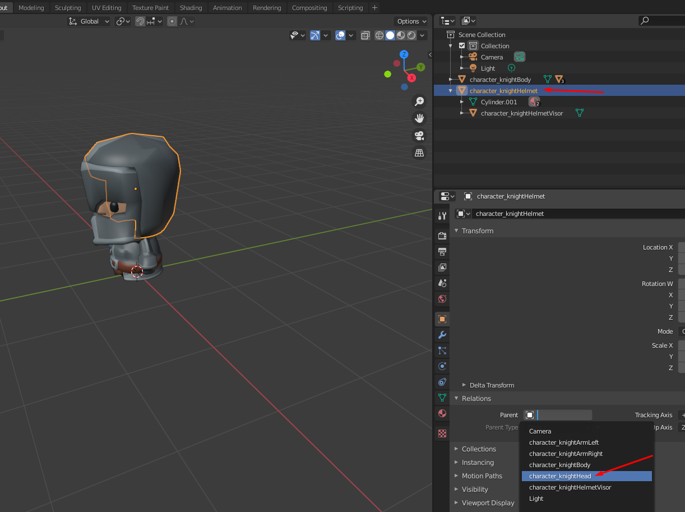

# Steps to prepare Kay animations to be used in babylonjs 

- Models and Animations https://kaylousberg.itch.io/
- BaylonJS https://www.babylonjs.com/

# Make hat move with anination of the head
- import the .fbx character to blender
- select the hat/helmet
- change parent to the head
- adjust z of the hat/helmet to fit the correct position 
- export as gltf with extension .glb

# Export animation
- import the .fbx with single animation
- export as .gltf with extension .glb
- uncheck, transform, Y up

